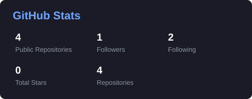

<!-- ================= HEADER ================= -->

  

<!-- ================= TYPING ANIMATION ================= -->

  

  
  

---

### 🧭 Currently

- Building cross-platform mobile apps with **Flutter** and **Dart**
- Building frontend interfaces with **React** and **JavaScript**
- Exploring **semantic search** and **AI-powered backends** (Flask, FAISS, Pandas)
- Learning the fundamentals of **software quality assurance** and test automation

 

### 🛠️ Tech Stack

  

  
  

---

### 📌 Featured Projects

<table>
<tr>
<td width="33%" valign="top">

**[splitsmart](https://github.com/itx-arsal-khan/splitsmart)**

Flutter app for splitting bills and shared expenses among groups — track who owes what and settle up.

`Flutter` `Dart`

</td>
<td width="33%" valign="top">

**[fais-quizsearch-engine](https://github.com/itx-arsal-khan/fais-quizsearch-engine)**

AI-powered full-stack quiz app with semantic search and dynamic question generation. Flask + Pandas backend, FAISS-powered retrieval.

`Python` `Flask` `FAISS` `Pandas`

</td>
<td width="33%" valign="top">

**[myfirstwebproject](https://github.com/itx-arsal-khan/myfirstwebproject)**

University Lost & Found portal — report, search, and claim lost items, with notes upload/download.

`React` `JavaScript`

</td>
</tr>
</table>

> More projects in progress — check [pinned repos](https://github.com/itx-arsal-khan?tab=repositories) for the latest.

---

### 📊 GitHub Stats

### 📊 GitHub Stats

  
  

<!-- ================= SNAKE CONTRIBUTION ANIMATION ================= -->
### 🐍 Contribution Snake

  

---

### 📇 Contact

  
  
  

  

